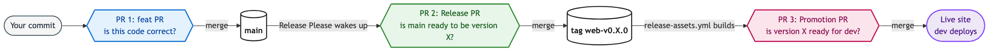

> 🌐 [English](../en/lab-08-self-proof-banner.md) &nbsp;·&nbsp; [日本語](../ja/lab-08-self-proof-banner.md) &nbsp;·&nbsp; **简体中文**

[← 回到 README](../../README.cn-zh.md) &nbsp;·&nbsp; [← Lab 7](./lab-07-first-deploy.md)

# Lab 8 — Self-Proof Banner

⏱ 15 分钟 &nbsp;·&nbsp; 💰 $0 &nbsp;·&nbsp; 简历自证

## 为什么

部署上线的站点渲染出了你的简历。招聘经理打开,看到内容 —— 没问题。但他们没有办法知道站点本身是一个 CI/CD 演示。

本仓库已经出厂自带的 `PipelineBanner.tsx` 组件会加一条低调的页脚条(桌面端)或右下角的浮动小药丸(移动端),读取流水线自身的元数据并声明:

> `staging · web-v0.2.0 · abc1234 · shipped 14:22 JST · ℹ pipeline info`

点 `ℹ` 会打开一个 Dialog,由 **Source → Build → Artifact** 三张 hop 卡组成,每张卡都带一个来源证明 pip(● attested / ◐ imagined)。你在 Lab 8 写入的 4 个字段会填满 **Artifact** 卡(release tag、build time、artifact key、可选的 image digest);**Source** 和 **Build** 卡会保持半填状态(`source repo n/a` / `workflow run · —`),直到后续 lab 把 commit / workflow-run 字段加进 `pipeline-info.json` 的 v2 schema。

现在它显示为 **BOOTSTRAP red** —— 因为 `/pipeline-info.json` 还不存在。你在 Lab 8 要做的,就是那一条把它写出来的 workflow step。下一次发布之后,banner 会从红色切到实时数据。

> vs _单独做一个 pipeline dashboard 页面_ —— 招聘者很少点二级导航;页脚一直都在。  
> vs _在顶部加个醒目徽章_ —— 你不希望简历看起来像 demo;页脚保持「简历第一」的观感。

## 做什么

1. **在本地看 BOOTSTRAP 状态**。在 **repo 根目录** 下,先装依赖(只要装一次),再启 Vite dev 服务器:
   ```
   npm ci --prefix app                 # 只需第一次;创建 app/node_modules(~30 秒)
   ```
   ```
   npm run dev --prefix app
   ```
   打开 `http://localhost:5173`。桌面端(≥1280 px)会看到红色的页脚条显示 `⚠ BOOTSTRAP — pipeline hasn't shipped yet`;移动端会折叠成右下角的红色浮动小药丸。点 `ℹ`(或直接点小药丸)打开 Dialog 的 bootstrap 解释,然后停服务(`Ctrl-C`)。

   > 💡 `ENOENT` / `Cannot find module 'vite'` / `could not determine executable to run` 说的其实都是同一件事 —— 你不在 repo 根目录,或者 `npm ci` 还没跑过。`--prefix app` 用的是相对于当前目录的路径,所以两个前提都得满足。

2. **浏览一下组件** —— 看一眼 `fetch('/pipeline-info.json')` 调用和三态加载机:
   ```
   less app/src/components/PipelineBanner.tsx
   ```

3. **添加 workflow step**。编辑 `.github/workflows/release-assets.yml`。把这个 step 插入在 `Derive release metadata` 和 `Package static site` 之间:
   ```yaml
   - name: Write pipeline-info.json into the artifact
     run: |
       cat > app/public/pipeline-info.json <<EOF
       {
         "releaseTag":     "${{ steps.meta.outputs.release_tag }}",
         "shortSha":       "${{ steps.meta.outputs.short_sha }}",
         "buildTimestamp": "$(date -u +%Y-%m-%dT%H:%M:%SZ)",
         "artifactKey":    "${{ steps.meta.outputs.artifact_key }}"
       }
       EOF
   ```
   (如果存在,banner 还会显示 `buildDurationSec` 和 `imageSha` —— Lab 8 里 4 字段就够了。)

4. **在 `app/src/components/PipelineBanner.tsx` 里加一行注释**,让同一个 PR 同时碰到 `app/`。比如在 `fetch('/pipeline-info.json')` 旁边写 `// wired by release-assets.yml "Write pipeline-info.json" step`。Release Please 的 config 把 `web` 组件限定在 `app/**`,所以只改 `.github/workflows/` 不会触发版本递增,Lab 8 永远发不出新 release,banner 也就永远不会切换。

5. **Commit + push + PR:**
   ```
   git checkout -b feat/lab-8-self-proof-banner
   ```
   ```
   git add .github/workflows/release-assets.yml app/src/components/PipelineBanner.tsx
   ```
   ```
   git commit -m "feat(web): wire pipeline-info.json into release build"
   ```
   ```
   git push -u origin feat/lab-8-self-proof-banner
   ```
   ```
   gh pr create --fill
   ```

6. **三个 PR 的级联 —— CI/CD 在这里从概念变成现实。**

   你刚才写的一行代码,会通过 **三个独立的 pull request** 才最终流到 live 站点。每个 PR 在回答不同的问题,都是一道独立的审核闸。看懂这三道闸,整个平台的图景就清楚了:

   

   <details>
   <summary>文本版(ASCII)</summary>

   ```
   [1] feat PR        ─merge─▶  main
                                 ├─▶  Release Please 被唤醒
   [2] Release PR     ─merge─▶  tag web-v0.X.0
                                 ├─▶  release-assets.yml 构建 artifact
   [3] Promotion PR   ─merge─▶  live site(dev 部署)
   ```

   </details>

   | # | 谁开的 | 在决定什么 | diff 的样子 | 合并后发生 |
   |---|---|---|---|---|
   | 1 | 你 | 这段代码对不对? | 源代码 | Release Please 被唤醒 |
   | 2 | `github-actions[bot]`(Release Please) | `main` 可以被称为 version X 了吗? | 版本号更新 + CHANGELOG | 打 tag → 构建 artifact |
   | 3 | `github-actions[bot]`(release-assets) | version X 可以上 dev 了吗? | 只有 `artifactKey` + image digest | 上 dev |

   每一道闸都互相独立。拒掉 (2),代码留在 `main` 上、release 不切。拒掉 (3),artifact 在 S3 + ECR 里但什么都不部署。**这种分离就是关键** —— Lab 9 里,你会把 (3) 的同一份 artifact 直接部署到 staging,不需要重新构建,只要合 *第四个* PR、改 staging 的 manifest 就行。能这样做,全靠 (2) 和 (3) 是分开的两个 PR —— 如果代码直接部署,就没有「promotion」这回事。

   **(1/3) 你刚开的 feat PR**。
   - 内容:`release-assets.yml` 里加的 step + `PipelineBanner.tsx` 里的一行注释。
   - CI 绿了就合并,然后回到 main:
     ```
     gh pr merge <n> --auto --squash --delete-branch
     ```
     ```
     git checkout main
     ```
     ```
     git pull
     ```

   **(2/3) Release Please PR** —— (1) 合并后 ~30 秒自动开出来。
   - 标题:`chore(main): release web 0.X.0`。Author:`github-actions[bot]`。
   - diff:`.release-please-manifest.json` + `app/package.json` 的版本号上去了,`app/CHANGELOG.md` 新增一节,里头是你的 commit 主题。
   - 和 Lab 5 一样的 bot-loop —— close + reopen 一下踢醒 CI,然后合并([`concepts/bot-loop-workaround.md`](./concepts/bot-loop-workaround.md)):
     ```
     gh pr close <n>
     ```
     ```
     gh pr reopen <n>
     ```
     ```
     gh pr merge <n> --auto --squash --delete-branch
     ```
     ```
     git pull
     ```
   - 合并后:tag `web-v0.X.0` 被切出来 → `release-assets.yml` 因这个 tag 被触发 → 把 `pipeline-info.json` 烤进 `site.zip`,并推一个新的 ECR image → 自动开出 PR (3)。

   **(3/3) Promotion PR** —— (2) 的 build 跑完后自动开(~3–4 分钟)。
   - 标题:`chore(development): promote web v0.X.0`。Author:`github-actions[bot]`。
   - diff:**纯粹的部署意图 —— 零代码改动**。`deploy/static/development/site.json` 里新的 `artifactKey` + `release.version`,`deploy/ecs/development/task-definition.json` 里新的 image digest。**manifest 就是部署合同**。
   - 合并:
     ```
     gh pr merge <n> --auto --squash --delete-branch
     ```
     ```
     git pull
     ```
   - 合并后:`deploy-static.yml` + `deploy-ecs.yml` 并行触发。你的新 `/pipeline-info.json` 落到 dev。

7. **重新加载部署 URL**。页脚从红色翻成 live:显示 release tag、short SHA、build time、artifact key。这个浏览器第一次看到有效的 `/pipeline-info.json` 时,Dialog 会自动打开一次,页脚条/小药丸上会有一圈持续 24 小时的 border-beam 作为从红色翻到 live 的视觉强化。之后任何时候点 `ℹ` 都能重新打开这张三段 hop 的证明 Dialog。

## 验证

- 部署站点的每一页底部都有页脚条。
- 点 `ℹ` 打开的 Dialog 里 **Artifact** hop 完全填满(release tag、SHA、build time、artifact key);**Source** 和 **Build** hop 会保持半填,直到 `pipeline-info.json` 升级到 v2 schema。
- bootstrap 状态的 URL(还没发布过)依然显示 **红色**。
- 新发布合并并部署之后 Lab 8 的进度徽章变 ✓。

## 你刚刚做到的

为部署上线的简历添加了一张自我声明的凭证。任何愿意看的访客都能从产物本身验证:这是由一条真实的 CI/CD 流水线造出来的,而不是手工上传。产品和证明现在是同一个产物。

> ☕ 在页脚上右键 → **查看网页源代码**。`/pipeline-info.json` 的 fetch 和 DOM 里的 release tag,就是你的 CI/CD 流水线刚刚写给每一位访客浏览器的明信片。

## 下一个

[Lab 9 — First Promotion (dev → staging)](./lab-09-first-promotion.md)
