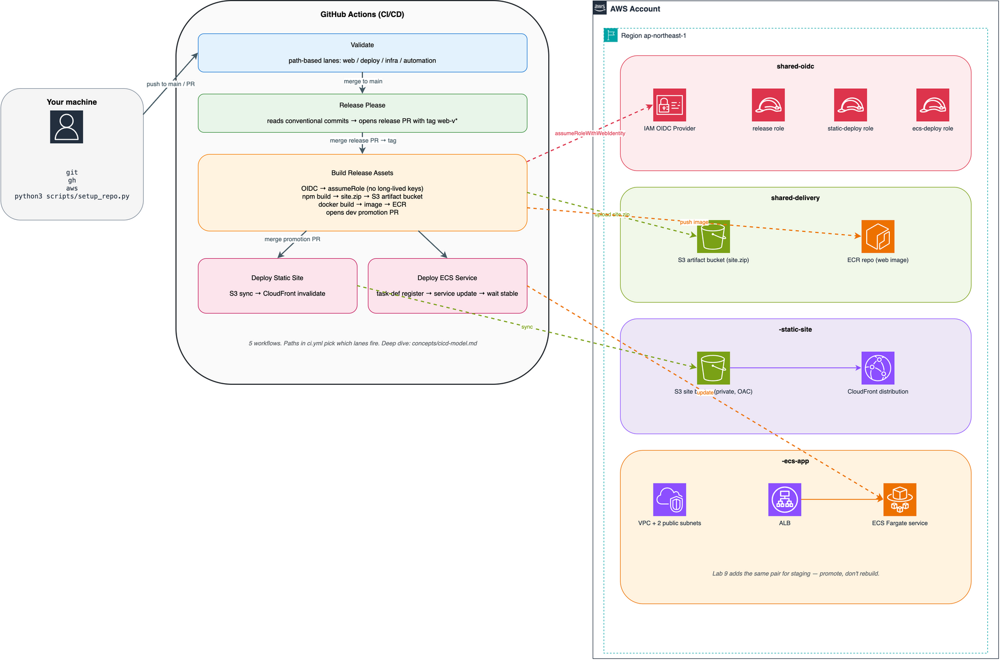

> 🌐 **English** &nbsp;·&nbsp; [日本語](../../ja/concepts/architecture.md) &nbsp;·&nbsp; [简体中文](../../cn-zh/concepts/architecture.md)

[← Back to README](../../../README.md)

# Architecture

One diagram, then the pieces.

## Full picture



<details>
<summary>Text fallback (ASCII)</summary>

```
   ┌────────────────────┐      ┌──────────────────────────────────────────┐
   │                    │      │        GitHub Actions (CI/CD)            │
   │   Your machine     │      │                                          │
   │                    │ push │  ┌─────────┐   merge   ┌────────────┐    │
   │  git + gh + aws    ├─────▶│  │Validate │──────────▶│ release-   │    │
   │  setup_repo.py     │      │  │(path    │  to main  │ please bot │    │
   │                    │      │  │ lanes)  │           │ opens PR   │    │
   └────────────────────┘      │  └─────────┘           └──────┬─────┘    │
                               │                               │ merge    │
                               │                       tag web-v*         │
                               │                               ▼          │
                               │  ┌──────────────────────────────────┐    │
                               │  │      Build Release Assets        │    │
                               │  │                                  │    │
                               │  │  OIDC → assumeRole (no keys)     │    │
                               │  │    ↓                             │    │
                               │  │  npm build → site.zip → S3       │    │
                               │  │  docker build → image → ECR      │    │
                               │  │    ↓                             │    │
                               │  │  open dev promotion PR           │    │
                               │  └──────────────────┬───────────────┘    │
                               │                     │ merge PR            │
                               │                     ▼                     │
                               │  ┌─────────────┐  ┌─────────────┐         │
                               │  │ Deploy      │  │ Deploy      │         │
                               │  │ Static Site │  │ ECS Service │         │
                               │  └──────┬──────┘  └──────┬──────┘         │
                               └─────────┼────────────────┼────────────────┘
                                         │                │
                                         ▼                ▼
   ┌─────────────────────────────────────────────────────────────────┐
   │                          AWS Account                            │
   │                                                                 │
   │   ┌──────────────────────────┐   ┌──────────────────────────┐   │
   │   │  shared-delivery         │   │  shared-oidc             │   │
   │   │   • S3 artifact bucket   │   │   • GitHub OIDC provider │   │
   │   │   • ECR repo (web)       │   │   • 3 scoped roles       │   │
   │   └──────────────────────────┘   └──────────────────────────┘   │
   │                                                                 │
   │   ┌──────────────────────────┐   ┌──────────────────────────┐   │
   │   │  dev-static-site         │   │  dev-ecs-app             │   │
   │   │   • S3 site bucket       │   │   • VPC + 2 subnets      │   │
   │   │   • CloudFront dist      │   │   • ALB                  │   │
   │   │                          │   │   • ECS Fargate service  │   │
   │   └──────────────────────────┘   └──────────────────────────┘   │
   │                                                                 │
   │   [same pair for staging when Lab 9 adds it]                    │
   │                                                                 │
   └─────────────────────────────────────────────────────────────────┘
```

</details>

## The pieces

**Your machine.** Runs git + gh (GitHub CLI) + aws (AWS CLI) + `setup_repo.py` (the wizard). You never hold a long-lived AWS key here — the wizard uses your existing AWS credentials (IAM Identity Center / AWS SSO) to call CloudFormation, and GitHub Actions uses OIDC for its runtime access.

**GitHub Actions.** Five workflows:

- `Validate` — path-based lanes (`web`, `deploy`, `infra`, `automation`). Every PR + every push to main.
- `Release Please` — reads conventional commits on main, opens/updates release PRs.
- `Build Release Assets` — fires on `web-v*` tags. Builds site.zip → S3, docker image → ECR. Opens dev promotion PR.
- `Deploy Static Site` — fires on merged PRs that touch `deploy/static/**`. Syncs S3 → invalidates CloudFront.
- `Deploy ECS Service` — fires on merged PRs that touch `deploy/ecs/**`. Registers task-def, updates service, waits stable.

**OIDC federation.** `shared-oidc` stack creates an OpenID Connect provider trusted by `token.actions.githubusercontent.com`. Three scoped roles (release, static-deploy, ecs-deploy) can be assumed only by workflows in this specific repository. No long-lived keys in GitHub secrets; tokens are per-job and expire in ~1 hour.

**Shared delivery.** `shared-delivery` stack creates:
- One S3 bucket for the site zip (lifecycle-transitioned to Glacier after N days)
- One ECR repo for the web image (image scanning enabled, lifecycle-prunes untagged after 7 days)

These are shared across all environments because the artifact is the same artifact — that's the whole point.

**Per-environment: static site.** `<env>-static-site` stack creates:
- One private S3 bucket (content bucket)
- One CloudFront distribution (serving from that bucket via Origin Access Control)

**Per-environment: ECS app.** `<env>-ecs-app` stack creates:
- One VPC with 2 public subnets (no NAT for cost — cheaper; task pulls image from ECR via VPC endpoint)
- One ALB with HTTP listener → ECS target group
- One ECS cluster + Fargate service + task definition
- One task execution role + task role (least-privilege)
- One CloudWatch log group

The two deploy targets are independent — same artifact, different runtimes. Lab 7 deploys both in parallel so you can compare.

## Why this shape

- **CloudFormation, not Terraform** — one fewer toolchain. Stack deletion is atomic; [`Lab 10`](../lab-10-teardown.md) teardown is guaranteed-safe.
- **Push mode, not pull mode** — every deploy step is visible in a GH Actions log. See [`cicd-model.md`](./cicd-model.md).
- **Manifest-driven state** — the `deploy/*/*.json` files are the environment contract. Every deploy is a reviewable PR.
- **Two deploy targets** — so you personally feel the difference in Lab 7 instead of reading about it in the abstract.

## For more detail

- [`infrastructure.md`](./infrastructure.md) — stack-by-stack inventory, resource naming patterns, how to add production
- [`cicd-model.md`](./cicd-model.md) — push vs pull, release-please, promotion semantics
- [`github-setup.md`](./github-setup.md) — branch protection, merge policy, Actions variables
