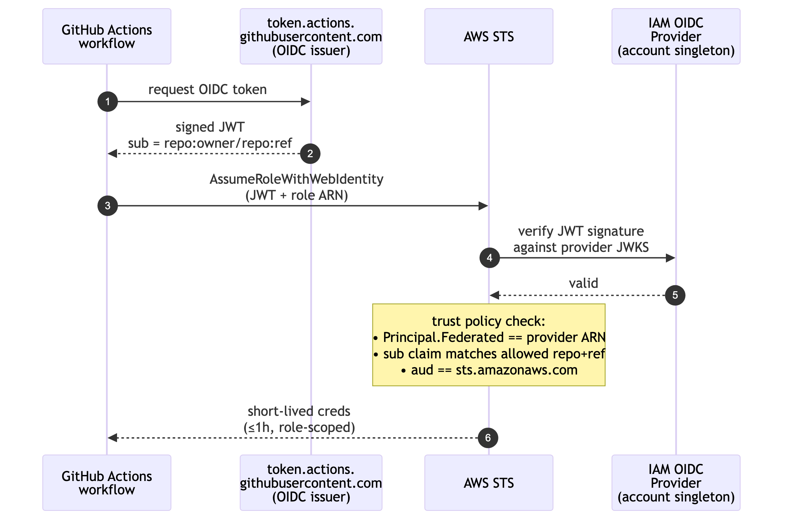

> 🌐 [English](../../en/concepts/oidc-federation.md) &nbsp;·&nbsp; **日本語** &nbsp;·&nbsp; [简体中文](../../cn-zh/concepts/oidc-federation.md)

[← README に戻る](../../../README.ja.md)

# GitHub Actions → AWS を OIDC でつなぐ

ラボのパイプラインが長期鍵なしで AWS と話す仕組み。一度読めば、Lab 3 以降のすべての `assume-role` 呼び出しでこのパターンが見えます。

## 6 ステップのフロー



<details>
<summary>テキスト版(ASCII)</summary>

```
┌──────────────────┐                            ┌─────────────────────┐
│ GitHub Actions   │   (1) OIDC トークン要求    │ token.actions.      │
│ workflow 実行    │ ─────────────────────────▶ │ githubusercontent   │
│                  │ ◀───────────────────────── │ .com (issuer)       │
└──────┬───────────┘   (2) 署名付き JWT         └─────────────────────┘
       │
       │ (3) aws-actions/configure-aws-credentials
       ▼
┌──────────────────┐                            ┌─────────────────────┐
│ AWS STS          │   (4) 署名を検証           │ IAM OIDC Provider   │
│                  │ ─────────────────────────▶ │ (アカウント内単一)  │
│                  │ ◀───────────────────────── │                     │
└──────┬───────────┘                            └─────────────────────┘
       │ (5) role trust policy チェック:
       │     Principal.Federated == <provider ARN>  ✓
       │     sub claim が許可された repo + ref と一致 ✓
       │     aud claim == "sts.amazonaws.com"       ✓
       ▼
┌──────────────────┐
│ 短命クレデンシャル │   (6) 最大 1 時間;role の権限範囲に限定
│ を workflow へ   │         (S3 PutObject / ECR PutImage など)
└──────────────────┘
```

</details>

1. workflow が GitHub の OIDC issuer にトークンを要求(無料・組み込み)
2. GitHub は自分の鍵で署名した JWT を返す。`sub` クレームに `repo:<owner>/<repo>:ref:<ref>` が入る
3. `aws-actions/configure-aws-credentials` が STS `AssumeRoleWithWebIdentity` を JWT と対象 role ARN で呼ぶ
4. STS は OIDC provider の JWKS を使って JWT の署名を検証。provider は GitHub の issuer URL + thumbprint を登録してある
5. STS が role の trust policy を評価:`Principal.Federated` がこの provider の ARN、`sub` クレームが許可された repo パターンに一致、`aud` クレームが `sts.amazonaws.com`
6. すべて通れば、STS が短命クレデンシャル(最大 1 時間)を workflow に返す。role の permissions policy がそのクレデンシャルでできることを決める

秘密は GitHub から漏れません。repo にも Actions 変数にも access key は置かれません。workflow が侵害されても、攻撃者は最長 1 時間の範囲限定アクセスしか手に入らず、role の権限外は何もできません。

## OIDC provider は AWS アカウントあたり 1 つ

AWS は issuer URL ごとに IAM OIDC Provider を **1 つ** しか持てません。同じ `token.actions.githubusercontent.com` の provider を 2 つ作ろうとすると `CreateOpenIDConnectProvider` API は `EntityAlreadyExists` を返します。

**なぜ**:provider は信頼のアンカーだから。同じ issuer に provider が 2 つあったら、STS はどちらの thumbprint を信じればいい?という曖昧さを避けるため、AWS は 1 つと決めています。

**このラボへの影響**:あなたの AWS アカウントに別のプロジェクト・以前のラボ実行・同僚の過去作業から GitHub OIDC provider が既にあると、`bootstrap-shared.yaml` は作り直せません。スタックは `EntityAlreadyExists` で失敗します。

## `setup_repo.py` がどう扱うか

最初の `apply` 前に wizard が `detect_github_oidc_provider_arn()` を呼びます:

```python
# scripts/setup_repo.py
aws iam list-open-id-connect-providers
  → "/token.actions.githubusercontent.com" で終わる ARN を探す
  → 見つかった場合:ARN を ExistingGitHubOidcProviderArn パラメータに渡す
  → 無い場合:パラメータを空のままにして CFN に作らせる
```

CFN テンプレートはこうなっています:

```yaml
Conditions:
  CreateGitHubOidcProvider: !Equals [!Ref ExistingGitHubOidcProviderArn, ""]

Resources:
  GitHubOidcProvider:
    Condition: CreateGitHubOidcProvider   # 既存がある場合はスキップ
    Type: AWS::IAM::OIDCProvider
    ...

  ReleaseRole / StaticDeployRole / EcsDeployRole:
    AssumeRolePolicyDocument:
      Statement:
        - Principal:
            Federated: !If
              - CreateGitHubOidcProvider
              - !Ref GitHubOidcProvider              # たった今作ったやつ
              - !Ref ExistingGitHubOidcProviderArn   # 検出したやつを再利用
```

結果:role は「既に存在していた」provider でも「このスタックが作った」provider でも、正しいやつを信頼する。同じ AWS アカウントを複数の学生が共有しても、全員が同じ provider を共有します。

## 実際に見るには

- **AWS コンソール**:IAM → ID プロバイダ → `token.actions.githubusercontent.com` が 1 つ
- **CLI**:`aws iam list-open-id-connect-providers --profile <profile>`
- **自分の role**:IAM → ロール → `resume-shared-iam-gh-*-<resource-identifier>` → 信頼関係タブ → `Principal.Federated` が provider ARN を指している

## フェデレーションが失敗したら

この順序でチェック:

1. **provider が存在するか**:`aws iam list-open-id-connect-providers` に自分の URL が出るか。無ければ Lab 3 を再実行(apply が作り直す)
2. **role が正しい provider を信頼しているか**:`aws iam get-role --role-name <role> --query 'Role.AssumeRolePolicyDocument.Statement[0].Principal.Federated'` で provider ARN と一致するか
3. **workflow の `sub` がマッチするか**:role の trust policy は `token.actions.githubusercontent.com:sub` に `StringLike` がかかっている。workflow が tag 実行なのに trust policy が `refs/heads/*` しか許可していなければ、assume-role は拒否される
4. **`aud` クレーム**:`sts.amazonaws.com` でなければダメ。`configure-aws-credentials` は自動で設定するが、カスタム workflow で違う audience を渡すと拒否される
5. **GitHub token が付与されていない**:workflow に `permissions: id-token: write` が必要。無いと GitHub は OIDC トークンを発行しない

## 後片付け

provider は、アカウントに既に無い場合に限り `bootstrap-shared.yaml` が作る(上の `CreateGitHubOidcProvider` 条件参照)。`./scripts/setup_repo.py destroy` のときは:

- スタックが provider を作った場合:destroy がクリーンに削除
- 既存の provider を再利用した場合:destroy は触らない(他のプロジェクトが依存している可能性があるため)

これが正しい振る舞いです。Lab 10 が同じアカウント内の無関係なプロジェクトを壊してはいけません。
